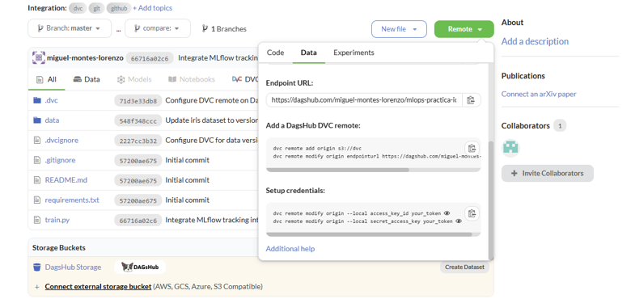

# Notas DVC

## intro

DVC es una herramienta de **control de versiones para datos y modelos**, similar a Git pero diseñada para control de datos de proyectos de data science y machine learning, en lugar de control de código.

Permite **rastrear datasets pesados, reproducir experimentos y gestionar pipelines** de forma eficiente y reproducible.

---

## diferencia respecto de Git

Git es inadecuado para gestionar grandes volúmenes de datos porque almacena los archivos completos dentro del repositorio, sin distinguir entre código y ficheros pesados. Al trabajar con datos binarios (CSV grandes, imágenes, modelos), Git no puede generar deltas eficientes, así que cada modificación provoca que se guarde una copia completa del archivo, haciendo que el repositorio crezca de forma desmesurada y sea lento de clonar, sincronizar y versionar.

DVC resuelve este problema separando claramente el control de versiones del contenido. En Git solo guarda **punteros pequeños** (hashes y metadatos) en forma de archivos `.dvc` o entradas en `dvc.lock`, mientras que los datos reales se almacenan en un *remote* especializado (S3, GCP, Azure, SSH o un directorio local) que está optimizado para manejar ficheros grandes. Esto mantiene el repositorio ligero y evita duplicaciones innecesarias de datos.

---

## instalación

El 100% del código base de DVC está escrito en Python, por lo que puede instalarse directamente en un entorno virtual a través de pip:

```bash
pip install "dvc[s3]"  # instalar DVC con soporte para S3
```

o como una herramienta global a través de pipx (o herramientas equivalentes):

```bash
pipx install "dvc[s3]"
```

```bash
uv tool install "dvc[s3]"
```

---

## comandos básicos

**1. Inicializar DVC en un repositorio**

```bash
dvc init
```

Esto crea la carpeta `.dvc/` y deja listo el proyecto para versionar datos.

> Es conveniente actualizar el .gitignore para evitar exponer ficheros de DVC que puedan contener datos sensibles

```
echo ".dvc/config.local" >> .gitignore
echo ".dvc/tmp/" >> .gitignore
echo ".dvc/cache/" >> .gitignore
```

**2. Añadir un archivo o carpeta grande al control de DVC**

```bash
dvc add data/raw-dataset.csv
```

Esto crea un archivo `data/raw-dataset.csv.dvc` (el *puntero*) y mueve el contenido real a la caché de DVC (`.dvc/cache`).

Para versionarlo con Git:

```bash
git add data/raw-dataset.csv.dvc
git commit -m "Add dataset under DVC"
```

**3. Configurar un remote en S3**

```bash
dvc remote add -d <storage> s3://my-bucket/path
```

Configurar credenciales (opcional si ya usas `aws configure`):

```bash
dvc remote modify <storage> access_key_id <AWS_KEY> --local
dvc remote modify <storage> secret_access_key <AWS_SECRET> --local
```

**4. Establecer un remote como predeterminado**

Esto define qué remote usará DVC automáticamente para las operaciones:

* `dvc push`
* `dvc pull`
* `dvc fetch`

Si haces:

```bash
dvc remote default <storage>
```

significa:

> “De todos mis remotes, **storage** será el que se use por defecto.”

*(Si lo creaste originalmente con `-d`, ya queda como predeterminado y no necesitas este paso.)*

**5. Subir datos al remote**

```bash
dvc push
```

Solo envía la caché necesaria (los blobs que correspondan a los punteros `.dvc`).

**6. Descargar datos del remote**

```bash
dvc pull
```

Útil cuando clonas un repo y quieres recuperar los datos pesados.

**7. Ver qué datos están sincronizados**

```bash
dvc status
```

Muestra si falta subir o bajar caché respecto al remote.

**8. Reproducir un pipeline**

Si tienes un `dvc.yaml`:

```bash
dvc repro
```

Reconstruye solo las etapas cuyo input cambió (similar a `make` pero para ML/data pipelines).

**9. Limpiar la caché local no usada**

```bash
dvc gc -w
```

Elimina blobs antiguos de la caché que no correspondan a ninguna versión activa del workspace.

---

## almacenamiento dvc en DagsHub

**DagsHub** es una plataforma colaborativa para proyectos de *machine learning* que integra control de versiones (Git), control de datos (DVC), seguimiento de experimentos (MLflow) y almacenamiento remoto, todo en un único entorno similar a GitHub.

En el contexto de DVC, DagsHub ofrece:

* **Un remote S3-compatible gratuito** asociado a cada repositorio.
* **Integración automática**: al crear un repo, DagsHub genera una URL de almacenamiento que puedes usar directamente como remote de DVC.
* **Gestión visual** de datasets, modelos y versiones desde la interfaz web.
* **Permisos y autenticación** mediante tokens personales, sin necesidad de configurar AWS.

Para usar DagsHub como remote basta con ejecutar los comandos proporcionados desde su propia interfaz web:



Añadir el repositorio:

```bash
dvc remote add origin s3://dvc  # añade el remoto "origin"
dvc remote modify origin endpointurl https://dagshub.com/<usuario>/<repo>.s3
```

Configurar credenciales (solo una vez):

```bash
dvc remote modify origin --local access_key_id <access_key_id> 
dvc remote modify origin --local secret_access_key <secret_access_key>
```

Establecer el remoto de dagshub como el remoto DVC por defecto del repositorio local:

```bash
dvc remote default origin
```

A partir de ahí, puedes usar:

```bash
dvc push   # subir datos a DagsHub
dvc pull   # descargar datos desde DagsHub
```

DagsHub actúa como un *bucket* S3 administrado, simplificando el flujo sin necesidad de AWS, Azure o GCP.

---

## automaticación de DVC con ficheros .yaml

// completa esto con un resumen de la sintaxis/estructura básica dvc.yaml, params.yaml ... (y una breve señalización de sus diferencias con la sintaxis de github actions). Mantén el mismo estilo y nivel de profundidad que las secciones previas de este .md
