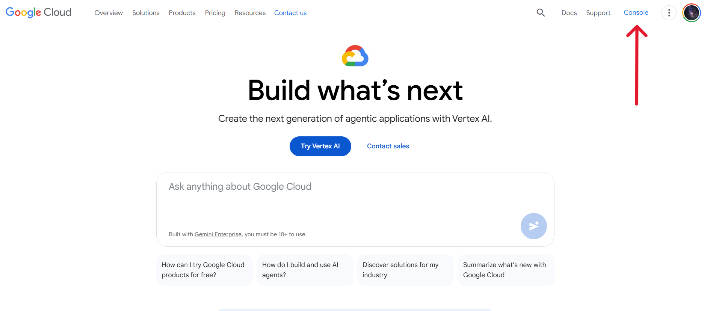
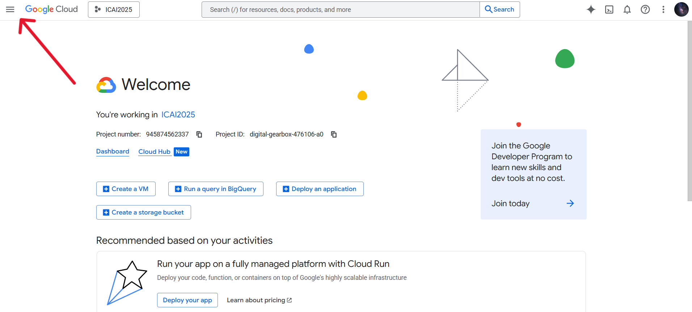

# Notas Google Cloud - GKE

## ¿Qué es Google Cloud?

Google Cloud Platform es la plataforma de computación en la nube de Google. Proporciona infraestructura y servicios para crear, ejecutar y escalar aplicaciones sin gestionar servidores físicos.

**¿Qué ofrece?**

- Infraestructura (IaaS): máquinas virtuales, redes, almacenamiento.
- Plataforma (PaaS): entornos gestionados para desplegar aplicaciones.
- Servicios gestionados: bases de datos, colas, analítica, ML.

## ¿Cómo funciona el sistema de cobro de Google Cloud?

Un billing account es un perfil creado dentro de Google Cloud para pagar el uso de los recursos de Google Cloud.

- Contiene un método de pago (tarjeta, domiciliación, etc.).
- Puede tener créditos promocionales asociados.

**Relación entre proyecto y billing account**

Toda la facturación real ocurre a nivel de billing account, no de proyecto.

- Cada proyecto debe estar asociado a una única billing account.
- Una billing account puede estar vinculada a varios proyectos.

**Modelo de cobro: pago por uso**

Google Cloud utiliza un modelo pay-as-you-go:

- No se paga por adelantado.
- Se factura exactamente lo que se consume.

El coste depende de:

- Tiempo de uso (CPU, memoria, nodos, horas de VM).
- Cantidad de datos almacenados.
- Tráfico de red.
- Número de peticiones o ejecuciones (en servicios serverless).

## ¿Qué es un proyecto?

Un projecto en Google Cloud es una agrupación de recursos necesarios para poner en marcha una aplicación. Todo proyecto está vinculado a un billing account.

Los recursos pueden ser cualquier tipo de herramienta u objeto cuya utilización o almacenamiento requiere una infraestructura técnica. Esta infraestructura técnica  cuesta dinero y que Google Cloud se encarga de proveer.

## ¿Qué es GKE?

GKE (Google Kubernetes Engine) es el servicio de Google Cloud para ejecutar Kubernetes sin tener que gestionarlo "a mano".

Google Cloud se encarga de:

- **Control plane (master)**: conjunto de componentes centrales de Kubernetes que representan y mantienen el estado lógico del clúster (API server, scheduler, etcd).
- **Actualizaciones**: procesos de cambio de versión y parcheo del propio software de Kubernetes que compone el clúster.
- **Alta disponibilidad**: propiedad arquitectónica por la cual el clúster sigue operativo aunque fallen algunos de sus componentes.
- **Seguridad básica**: configuración inicial de mecanismos de protección del clúster (identidad, certificados, aislamiento, políticas base).
- **Integración con IAM, Monitoring, Logs**: conexión nativa del clúster Kubernetes con los servicios de identidad y observabilidad de Google Cloud.

Tú te encargas de:

- **Contenedores**: imágenes autocontenidas que empaquetan una aplicación junto con su entorno de ejecución y dependencias.
- **Pods**: unidades mínimas de ejecución en Kubernetes, que agrupa uno o varios contenedores que comparten red y almacenamiento.
- **Deployments**: recursos declarativos de Kubernetes que describen el estado deseado de un conjunto de pods gestionados.
- **Servicios**: recursos de red de Kubernetes que definen una abstracción estable para acceder a un conjunto de pods.

## ENDPOINTS RELEVANTES

> La web de Google Cloud está organizada en secciones y subsecciones.
> Las secciones son:
>
> - Facturación
> - IAM y administración
> - Marketplace
> - Vertex AI
> - Compute Engine
> - Kubernetes Engine
> - Cloud Storage
> - Seguridad
> - BigQuery
> - Monitoring
> - Cloud Run
> - Red de VPC
> - Cloud SQL
>
> Para cambiar de sección hay que:
>
> 1. Entrar en Google Cloud Console
> 
> 2. Desplegar el menú de arriba a la izquierda:
> 

Facturación:

<https://console.cloud.google.com/billing/>  # facturación/
<https://console.cloud.google.com/billing/014506-6496FA-320584>  # facturación/descripción general/
<https://console.cloud.google.com/billing/projects>  # facturación/proyectos/
<https://console.cloud.google.com/billing/014506-6496FA-320584/credits/all>  # facturación/<cuenta>/creditos/todos los creditos/

APIs y Servicios:

## Pasos seguidos en la práctica de GKE

Crear el fichero `k8s/api-service.yaml`:

```
apiVersion: v1
kind: Service
metadata:
  name: mlops-api-service
spec:
  selector:
    app: mlops-api
  ports:
    - port: 5000
      targetPort: 5000
  type: ClusterIP
```

**Purpose:** Exposes the API Deployment **inside the cluster**.

- Defines a **ClusterIP Service**, which is only accessible from within Kubernetes.
- Selects pods labeled `app: mlops-api`.
- Forwards traffic from port **5000** of the service to port **5000** of the API containers.
- Provides a **stable DNS name** (`mlops-api-service`) for internal communication.

In short: this file allows **other services (like the web app)** to reliably communicate with the API.

---

Crear el fichero `k8s/api-deployment.yaml`:

```
apiVersion: apps/v1
kind: Deployment
metadata:
  name: mlops-api-deployment
spec:
  replicas: 1
  selector:
    matchLabels:
      app: mlops-api
  template:
    metadata:
      labels:
        app: mlops-api
    spec:
      containers:
        - name: mlops-api
          image: gcr.io/<PROJECT-ID>/mlops-api:latest  # substitute by Google Cloud project ID
          ports:
            - containerPort: 5000
```

**Purpose:** Deploys the backend API application.

- Defines a **Deployment** that manages the lifecycle of the API pods.
- Ensures **1 replica** of the API container is running.
- Specifies which **Docker image** to run (`mlops-api`) and exposes port **5000** inside the container.
- Uses labels (`app: mlops-api`) so other Kubernetes resources (like Services) can target these pods.

In short: this file is responsible for **running and keeping alive the API application** inside the cluster.

---

Crear el fichero `k8s/web-service.yaml`:

```
apiVersion: v1
kind: Service
metadata:
  name: mlops-web-service
spec:
  selector:
    app: mlops-web
  ports:
    - protocol: TCP
      port: 80
      targetPort: 8501
  type: LoadBalancer
```

**Purpose:** Exposes the web application **to the outside world**.

- Defines a **LoadBalancer Service**, which in GKE provisions a **public external IP**.
- Maps port **80** (HTTP) externally to port **8501** inside the web container.
- Selects pods labeled `app: mlops-web`.

In short: this file makes the **web UI accessible from the internet** via a public IP.

---

Crear el fichero `k8s/web-deployment.yaml`:

```
apiVersion: apps/v1
kind: Deployment
metadata:
  name: mlops-web-deployment
  labels:
    app: mlops-web
spec:
  replicas: 1
  selector:
    matchLabels:
      app: mlops-web
  template:
    metadata:
      labels:
        app: mlops-web
    spec:
      containers:
        - name: mlops-web
          image: gcr.io/<PROJECT-ID>/mlops-web:latest  # substitute by Google Cloud project ID
          ports:
            - containerPort: 8501
          env:
            - name: API_URL
              value: http://mlops-api-service:5000/predict
```

**Purpose:** Deploys the frontend web application.

- Defines a **Deployment** for the web UI (Streamlit app).
- Runs **1 replica** of the web container on port **8501**.
- Injects the environment variable `API_URL`, pointing to the internal API service:

  ```
  http://mlops-api-service:5000/predict
  ```

- Uses labels (`app: mlops-web`) to be targeted by its Service.

In short: this file is responsible for **running the user-facing web application** and configuring it to call the API.

---

**Overall architecture summary**

- **Deployments** (`*-deployment.yaml`)
  → Run and manage containers (API and Web).
- **Services** (`*-service.yaml`)
  → Provide networking, discovery, and exposure.
- **API Service**
  → Internal-only (`ClusterIP`).
- **Web Service**
  → Public-facing (`LoadBalancer`).

This separation follows standard Kubernetes best practices: **internal microservice + external frontend**, cleanly decoupled and scalable.

---

Añadir este job al cml.yaml:

```
name: MLOps with CML
on: [push, pull_request]  # lo primero que hace el clúster es un pull request del repositorio indicado
                          # hacer esto pondrá en marcha el pipeline automáticamente

  # ...

  deploy-to-gke:
    needs: train-and-report
    runs-on: ubuntu-latest

    steps:
      - name: Checkout Repository
        uses: actions/checkout@v3

      # --- custom: ensure dependencies installed
      - name: DVC and Python setup
        uses: iterative/setup-dvc@v1

      - name: Setup Python
        uses: actions/setup-python@v4
        with:
          python-version: "3.11"

      - name: Install DVC S3 plugin
        run: |
          python3 -m pip install --upgrade pip
          pip install "dvc[s3]"

      - name: DVC Pull (model + data if needed)
        env:
          DAGSHUB_API_KEY: ${{ secrets.DAGSHUB_API_KEY }}
        run: |
          dvc remote modify origin --local access_key_id $DAGSHUB_API_KEY
          dvc remote modify origin --local secret_access_key $DAGSHUB_API_KEY
          dvc pull -r origin

      - name: Check model exists
        run: |
          ls -lah
          test -f model.pkl && echo "model.pkl OK" || (echo "model.pkl NO EXISTE" && exit 1)
      # --- custom: end

      - name: Authenticate to Google Cloud
        uses: google-github-actions/auth@v2
        with:
          credentials_json: '${{ secrets.GCP_SA_KEY }}'
      
      - name: Set up gcloud CLI and kubectl
        uses: google-github-actions/setup-gcloud@v2
        with:
          install_components: gke-gcloud-auth-plugin

      - name: Debug vars
        run: |
          echo "GKE_CLUSTER='${{ secrets.GKE_CLUSTER }}'"
          echo "GKE_ZONE='${{ secrets.GKE_ZONE }}'"
          echo "GCP_PROJECT_ID='${{ secrets.GCP_PROJECT_ID }}'"
          test -n "${{ secrets.GKE_ZONE }}" || (echo "GKE_ZONE está VACÍA" && exit 1)

      - name: Get GKE credentials
        run: |
          gcloud container clusters get-credentials \
            ${{ secrets.GKE_CLUSTER }} \
            --zone ${{ secrets.GKE_ZONE }} \
            --project ${{ secrets.GCP_PROJECT_ID }}

      - name: Configure Docker to use GCR
        run: |
          gcloud auth configure-docker gcr.io --quiet

      # --- CONSTRUIR, ESCANEAR Y SUBIR IMAGEN DE LA API (mlops-api) ---
      - name: Build API Docker Image
        run: |
          IMAGE="gcr.io/${{ secrets.GCP_PROJECT_ID }}/mlops-api:latest"
          docker build -t "$IMAGE" .

      - name: Trivy Scan for API Image
        uses: aquasecurity/trivy-action@master
        with:
          image-ref: gcr.io/${{ secrets.GCP_PROJECT_ID }}/mlops-api:latest
          format: table
          exit-code: '1'
          severity: CRITICAL

      - name: Push API Docker Image
        run: |
          IMAGE="gcr.io/${{ secrets.GCP_PROJECT_ID }}/mlops-api:latest"
          docker push "$IMAGE"
      # ---

      # --- CONSTRUIR, ESCANEAR Y SUBIR IMAGEN DE LA WEB (mlops-web) ---
      - name: Build Web Docker Image
        run: |
          IMAGE="gcr.io/${{ secrets.GCP_PROJECT_ID }}/mlops-web:latest"
          docker build -t "$IMAGE" -f Dockerfile.web .

      - name: Trivy Scan for Web Image
        uses: aquasecurity/trivy-action@master
        with:
          image-ref: gcr.io/${{ secrets.GCP_PROJECT_ID }}/mlops-web:latest
          format: table
          exit-code: '1'
          severity: CRITICAL

      - name: Push Web Docker Image
        run: |
          IMAGE="gcr.io/${{ secrets.GCP_PROJECT_ID }}/mlops-web:latest"
          docker push "$IMAGE"
      # ---

      - name: Deploy API to GKE
        run: |
          # api deployment
          kubectl apply -f k8s/api-deployment.yaml
          kubectl apply -f k8s/api-service.yaml
          # web deployment
          kubectl apply -f k8s/web-deployment.yaml
          kubectl apply -f k8s/web-service.yaml
```

GitHub Actions solo ejecuta comandos en una máquina temporal; no decide permisos ni almacena la imagen. No estás haciendo un push a GitHub, sino a **Google Cloud** (`gcr.io`).

En este paso del workflow te autenticas **como una service account de Google Cloud**:

```yaml
- uses: google-github-actions/auth@v2
  with:
    credentials_json: '${{ secrets.GCP_SA_KEY }}'
```

Después, Docker se configura para usar esa identidad al hacer push a `gcr.io`:

```yaml
- name: Configure Docker for GCR
  run: gcloud auth configure-docker gcr.io --quiet
```

Cuando ejecutas:

```yaml
- name: Build and Push API Docker Image
  run: |
    docker build -t gcr.io/${{ secrets.GCP_PROJECT_ID }}/mlops-api:latest .
    docker push gcr.io/${{ secrets.GCP_PROJECT_ID }}/mlops-api:latest
```

Google Cloud comprueba los permisos de **esa service account**. Como `gcr.io` ahora está gestionado por **Artifact Registry**, si el repositorio no existe exige el permiso `artifactregistry.repositories.createOnPush`. Si la service account no lo tiene, el push falla.

---

Ejectuar lo siguiente en la consola de Google Cloud para poner en marcha el clúster:

```
export PROJECT_ID="digital-gearbox-476106-a0"  # proyect ID del proyecto ICAI2025
gcloud config set project $PROJECT_ID  # configura el proyecto activo por defecto del CLI gcloud

# Poner en marcha el cluster
gcloud container clusters create mlops-gke-cluster \
  --zone us-central1-a  # indica en qué zona física de Google Cloud se despliega el clúster \
  --num-nodes 2  # crea un node pool inicial con 2 nodos \
  --service-account="icai2025@${PROJECT_ID}.iam.gserviceaccount.com"  # indicar el uso de la cuenta de servicio son los permisos adecuados

gcloud artifacts repositories create gcr.io \
  --repository-format=docker \
  --location=us \
  --description="Compat repo for gcr.io"

# Cargar credenciales del cluster en kubeconfig
gcloud container clusters get-credentials mlops-gke-cluster \
  --zone us-central1-a \
  --project digital-gearbox-476106-a0
```

> Para comprobar si el cluster está activo (si existe), ejecutar lo siguiente:
>
> ```
> gcloud container clusters list
> ```

> Para parar el servidor, ejecutar lo siguiente:
>
> ```
> gcloud container clusters delete mlops-gke-cluster \
>   --zone us-central1-a
> ```

---

Añadir los siguientes secretos a GitHub (**Settings** $\to$ **Secrets and variables** $\to$ **Actions**):

- **GCP_SA_KEY**: Contenido completo del JSON de la service account. (en caso de no contar con el `.json` del service account, desde Google Cloud se puede descargar uno nuevo fácilmente)

- **GCP_PROJECT_ID**: ID del proyecto (**digital-gearbox-476106-a0**)

- **GKE_CLUSTER**: Nombre dado al clúster (**mlops-gke-cluster**)

- **GKE_ZONE**: Zona horaria seleccionada para el alojamiento del clúster (**us-central1-a**)

---

Probar la API

```
kubectl run -it --rm --restart=Never curltest \
  --image=curlimages/curl:8.5.0 \
  -- sh -lc 'curl -s -X POST -H "Content-Type: application/json" -d "{\"features\": [5.1, 3.5, 1.4, 0.2]}" http://mlops-api-service:5000/predict'
```

Resultado esperado:

```
{"prediction": 0}
```

---

**Acceder al endpoint del front-end web**

Listar los servicios que se encuentran en ejecución en el clúster:

```
kubectl get services
```

Resultado esperado:

```
NAME                TYPE           CLUSTER-IP     EXTERNAL-IP      PORT(S)
mlops-api-service   ClusterIP      10.xxx.xxx.x   <none>           5000/TCP
mlops-web-service   LoadBalancer   10.xxx.xxx.x   34.xxx.xxx.xxx   80:3xxxx/TCP
kubernetes          ClusterIP      34.xxx.xxx.x   <none>           443/TCP
```

Acceder a la `External-IP` de mlops-web-service:

```
http://<EXTERNAL-IP>
```

---
