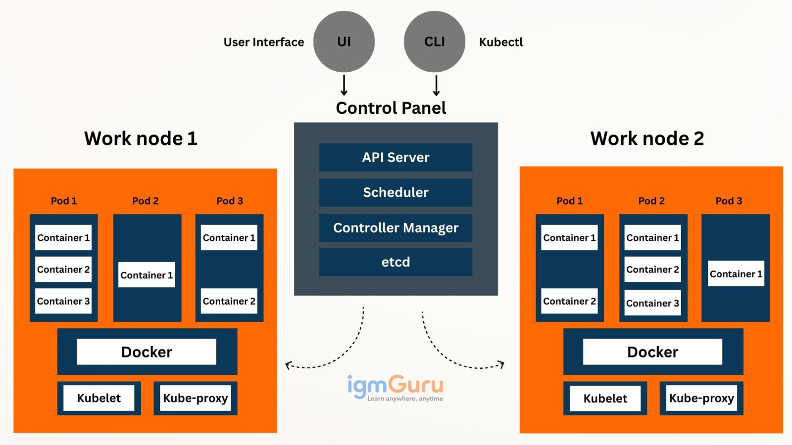

# Notas Kubernetes

## ¿Qué es Kubernetes?

**¿Qué es Kubernetes?**

Kubernetes es una plataforma de orquestación de contenedores. Es decir, un sistema automático de gestión de programas que corren en contenedores cuando esos programas ya no caben en un solo ordenador.  

Kubernetes no es un programa único, sino un conjunto de componentes (API server, scheduler, controller manager, kubelet…) que pueden desplegarse de muchas formas: on-premise, en la nube o en local.

Para desplegar el clúster que pone Kubernetes en ejecución es necesario utilizar alguna de las siguientes herramientas:

- **Minikube**
  Clúster local para desarrollo y aprendizaje.

- **kind**
  Kubernetes dentro de Docker, muy usado en CI.

- **kubeadm**
  Instalación "manual" de Kubernetes en máquinas reales o VMs.

- **Google Kubernetes Engine, Amazon EKS, Azure AKS**
  Kubernetes gestionado en la nube.

**¿En qué se diferencia de Docker compose?**

// TODO

**¿En qué circunstancias es útil Kubernetes?**

// TODO

## ¿Cómo funciona kubernetes?

// TODO

## ¿Cómo controlar el API Server?

**Instalaciones**

// qué es minikube?

// porqué es necesario que esté funcionando el container manager (Docker Desktop)? Es necesario?

// qué es Kubectl-CLI? Es simplemente el nombre de la CLI oficial para hablar con en API Server?

**Deployments**

// ...
